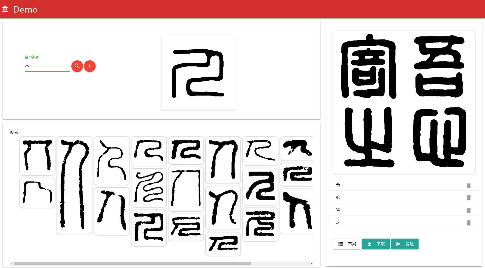

# seal-merge-demo



a combination of seal-search and seal-compose-demo

查、拼、发送一体化

左上角查字，下方显示所有参考篆字及相关篆字，右侧进行拼印

发送按钮自动打印成品，后期与篆刻机整合

## online demo

[http://seal.ncj.wiki](http://seal.ncj.wiki)

## usage

### local

```bash
cd src
npm install
npm start
```

### docker

#### run with pre-built image

```bash
docker pull registry.cn-hangzhou.aliyuncs.com/ncj/seal-merge-demo:v1
docker run -p 8080:8080 -i registry.cn-hangzhou.aliyuncs.com/ncj/seal-merge-demo:v1
```

#### build image

```bash
cd src
docker build . -t seal-merge-demo:v1
docker run -p 8080:8080 -i seal-merge-demo:v1
```